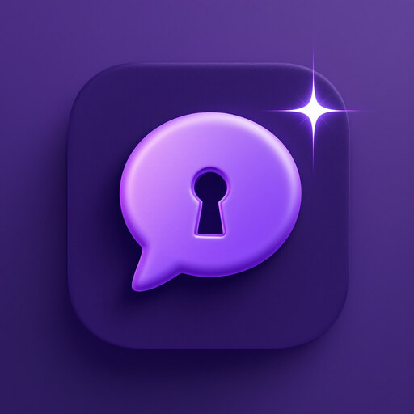

<p align="center">
  
</p>

# Sovatela

A small, friendly **desktop chat client** for **Z.ai's GLM-5.2**, served from
Europe on **Scaleway's Generative APIs**. Built with **Tauri v2 + Svelte 5**.

Each user brings their **own keys** ("BYO-key"), stored in the OS keychain. The
app has no backend of its own and collects nothing — everything runs locally and
talks only to the providers you configure.

## Design principle: sovereignty

The whole project is built to keep data in **Europe / out of US big-tech**
("Made in Europe/China"), and to be **self-reliant** — no shared server to
depend on. Every provider is brought by the user and billed to the user:

- **Chat** → GLM-5.2 (Z.ai) on Scaleway's EU infrastructure.
- **Image understanding** → a Mistral vision model (French) on Scaleway —
  GLM-5.2 is text-only.
- **Image generation** → **OVHcloud** (SDXL, French and EU-hosted) as the
  sovereign option, **Black Forest Labs** (German **FLUX**) for quality, or your
  own endpoint. BFL is the trade-off worth naming: better images, but a
  German-American company with a US entity that trains on your inputs by
  default. The app says so where you choose.
- **Web search** → **Linkup** (French search API), **Qwant Staan** (EU search
  API), or your own **SearXNG**. No US search APIs, no shared default.
- **History & memory** → stored **on your device** (or a folder you choose,
  e.g. your own cloud drive). Nothing is uploaded to the app's developer.
- **Artifacts** → generated by GLM-5.2, rendered **locally** in a sandbox.

### Why not just run GLM-5.2 in Ollama?

Ollama lists `glm-5.2`, which makes it look like you could run this model on
your own machine for free. You can't: the only tag is **`glm-5.2:cloud`**.
There are no weights to pull — GLM-5.2 is far too large for a laptop, so Ollama
runs it on **Ollama's own servers**, and you need an Ollama account and key
billed by Ollama.

That is a perfectly good product; it is just not a sovereign one. Ollama Inc. is
a US company, and its privacy policy says data "may be transferred to and
processed in the United States" and names its inference providers only
generically. It does state that prompts are processed transiently and never
trained on. So the choice for GLM-5.2 isn't local vs. hosted — both are hosted —
it's **whose cloud, under whose law**:

| | `glm-5.2:cloud` in Ollama | Sovatela |
| --- | --- | --- |
| Runs on | Ollama Inc.'s infrastructure | Scaleway, France |
| Jurisdiction | US; data may be processed in the US | EU |
| Inference sub-processor | Not disclosed | Named, single |
| Key & billing | Ollama account, billed by Ollama | Your Scaleway key, billed to you |

Where Ollama genuinely wins is its **local** models: a smaller open model
running fully offline on your hardware is more private than anything that
touches a network, costs nothing per token, and works on a plane. That's a
different trade — a weaker model and real hardware requirements — and it's a
good reason to use both tools. This app doesn't currently support a local
endpoint for chat; see the Roadmap.

## Features

- **Streaming chat** with GLM-5.2.
- **File uploads** — attach **documents** (PDF, .docx, .odt — text extracted
  in Rust), text/code (folded into context), and **images** (routed to the
  vision model). Files are read in memory and never stored.
- **Web search** (toggle 🌐) — the model searches when you ask, streaming its
  answer. Four EU paths: a **Linkup** API key (French search API, self-serve
  sign-up with a free tier — the recommended default), a **shared SearXNG
  server** (paste URL + token), a **local SearXNG** (click-to-run, needs
  Docker), or a **Qwant Staan** key (note: Staan sign-up is currently
  business-only with a review process). Settings has a **Save & test** button
  that runs a real query.
- **Image generation** (🎨) — **OVHcloud** (SDXL, the sovereign default),
  **Black Forest Labs** (FLUX, higher quality), or a custom OpenAI-images
  endpoint. No Docker or GPU needed. Off until you add a key. On FLUX you can
  **attach pictures** to generate from — a `flux-2-*` model takes up to eight
  and holds their style across a new image (a matching icon set, one character
  in different scenes), while a `flux-kontext-*` model edits a single picture to
  your instruction.
- **Artifacts** — ask for a chart/diagram/visual/app and it renders live in a
  right-hand canvas panel (sandboxed). All code blocks open in the panel; a
  session-wide **index** lets you revisit any artifact.
- **Chat history** — a sidebar (☰) of past conversations; reopen, delete, or
  start fresh. **Toggle recording off**, or **choose where it's saved** —
  including a folder your cloud drive syncs across devices.
- **Memory** — tell it *about you* and *how to respond* once; it applies to
  every chat. **Auto-memory** proposes durable facts to remember when a chat
  wraps up, which you approve.
- **Projects** — named containers with their own instructions and reference
  files, grouping related chats. The project's context is folded into each chat.
- **Quick start, Guide & Settings** — **Quick start** is three numbered steps to
  a working setup, sharing its cards with the welcome screen so first-run and
  later wording can't drift; the **Guide** tours what the app can do;
  **Settings** is an accordion for the API key, memory, web search, image
  generation, chat history, appearance, terminal access, and privacy.
- **Accessibility** — text scaling to 150% (*Settings → Appearance*), because a
  desktop app has no address bar to zoom with, and `prefers-reduced-motion` is
  honoured throughout, including in scripted scrolling that CSS alone can't
  reach. Known gaps are documented rather than glossed.

## How it works

- **Rust backend** (`src-tauri/src/lib.rs`) holds the Scaleway key in the OS
  keychain (`keyring`) and makes HTTPS calls with `reqwest` — done in Rust to
  avoid browser CORS and keep the key out of the webview.
- **Streaming** uses a Tauri `Channel`: Rust parses Scaleway's SSE stream and
  pushes tokens (and search-status / artifact events) to the Svelte UI.
- **Model routing**: text → `glm-5.2`; any image in the conversation →
  `mistral-small-3.1-24b-instruct-2503` (vision).
- **Web search**: when enabled, the model is forced to call a `web_search` tool;
  Rust queries Staan or SearXNG, feeds results back, and answers from them
  (multi-round, so it can search again). Today's date is injected so the model
  doesn't rely on stale training data.
- **Image generation**: Rust submits to Black Forest Labs, polls until ready,
  and downloads the result into a data URL (BFL's URLs expire fast).
- **Memory & projects**: personalization, remembered facts, and the active
  project's instructions + files are assembled into a system prompt **on every
  send** — never stored inside the saved conversation, so they can't go stale.
- **Artifacts** render in `<iframe sandbox="allow-scripts">` (no same-origin) +
  a strict CSP — generated code cannot reach Tauri, the keychain, or the network.

## Project layout

```
src/                     Svelte 5 frontend
  App.svelte             routing: welcome / overview / quickstart / chat / settings
  lib/KeyPage.svelte     onboarding + Settings (key, memory, search, image, history)
  lib/QuickStart.svelte  three-step setup for chat, search and images
  lib/Guide.svelte       feature guide (shown in the Overview)
  lib/Overview.svelte    first-run overview tour (Settings links to it)
  lib/Chat.svelte        chat, uploads, web search, artifacts, history, projects
  lib/History.svelte     sidebar: projects + saved conversations
  lib/ProjectPanel.svelte project editor (instructions + files)
  lib/MemoryReview.svelte approve auto-captured memories
  lib/Artifact.svelte    sandboxed artifact renderer (auto-height)
src-tauri/               Rust backend (keychain, Scaleway, search, images, memory)
deploy/searxng/          SearXNG for a token-gated server (advanced self-host)
deploy/searxng-local/    click-to-run local SearXNG (private, per-user)
deploy/flux-litellm/     LiteLLM proxy → BFL EU FLUX (legacy; native BFL is built in)
.github/workflows/       CI: cross-platform release builds on version tags
```

## Development

**Prerequisites:** Node 18+, **Rust** (`curl --proto '=https' --tlsv1.2 -sSf
https://sh.rustup.rs | sh`), and platform build tools (macOS:
`xcode-select --install`; see <https://tauri.app/start/prerequisites/>).

```sh
npm install
npm run icon         # generate app icons (first time only)
npm run tauri dev    # compile Rust + launch (first build is slow)
```

## Tests

```sh
npm run test:rust   # Rust: unit + send_chat mock-server scenarios
npm test            # frontend: markup parsing + markdown sanitization (vitest)
```

The backend scenario tests stand up a mock OpenAI-compatible server and never
contact an external provider.

## Releasing

Cross-platform installers build via GitHub Actions on a version tag:

```sh
# bump version in package.json, src-tauri/tauri.conf.json, src-tauri/Cargo.toml
git tag vX.Y.Z && git push origin vX.Y.Z
```

This produces a **draft release** in this (private) repo with a universal macOS
`.dmg` (Intel + Apple Silicon), Windows `.msi`/`.exe`, and Linux
`.deb`/`.AppImage`/`.rpm`.

Publishing is a second, deliberate step. This repo is the private working repo;
its releases are drafts and are not downloadable by users. Verify signing on the
drafted artifacts, then upload **those same files** — never a rebuild, which
would have different checksums — to a public release on `jacobla1/sovatela`, and
build the download page from them. Full procedure:
[`deploy/web/README.md`](deploy/web/README.md).

### Signing & notarization (macOS)

The release workflow **signs and notarizes** the macOS build automatically when
the GitHub secrets below are set. **Until they are set the build is simply
unsigned** (users open via System Settings → "Open Anyway"), so the workflow is
safe to run either way.

⚠️ **The same tolerance is a trap once you are shipping signed builds.**
`tauri-action` degrades to unsigned rather than failing when the certificate
expires or a secret goes missing, and *nothing in the CI log flags it* — so a
release can ship unsigned while the docs still promise otherwise. Verify against
the published artifact, every time:

```sh
hdiutil attach Sovatela_X.Y.Z_universal.dmg
spctl -a -t exec -vv /Volumes/Sovatela/Sovatela.app   # accepted / Notarized Developer ID
xcrun stapler validate /Volumes/Sovatela/Sovatela.app # ticket stapled — or it fails offline
hdiutil detach /Volumes/Sovatela
```

One-time setup:

1. **Enrol in the [Apple Developer Program](https://developer.apple.com/programs/)**
   (~$99/yr). Note your 10-character **Team ID** (Membership details).
2. **Create a "Developer ID Application" certificate** (Certificates → `+` →
   Developer ID Application). Download it, double-click to add it to your login
   keychain, then in Keychain Access export it (with the private key) as a
   `.p12` with an export password.
3. **Create an app-specific password** at
   [appleid.apple.com](https://appleid.apple.com) → Sign-In & Security →
   App-Specific Passwords (used for notarization).
4. Add these as **repository secrets** (Settings → Secrets and variables →
   Actions):

   | Secret | Value |
   |---|---|
   | `APPLE_CERTIFICATE` | the `.p12`, base64-encoded: `base64 -i cert.p12 \| pbcopy` |
   | `APPLE_CERTIFICATE_PASSWORD` | the `.p12` export password from step 2 |
   | `APPLE_SIGNING_IDENTITY` | `Developer ID Application: Your Name (TEAMID)` |
   | `KEYCHAIN_PASSWORD` | any random string (a temp keychain is created in CI) |
   | `APPLE_ID` | your Apple account email |
   | `APPLE_PASSWORD` | the app-specific password from step 3 |
   | `APPLE_TEAM_ID` | your 10-character Team ID |

Then push a tag as above — the macOS `.dmg`/`.app` is signed with the Developer
ID identity, notarized by Apple, and the ticket stapled, so it opens without
Gatekeeper warnings. (App Store Connect API-key notarization is an alternative
to the Apple ID method: swap `APPLE_ID`/`APPLE_PASSWORD`/`APPLE_TEAM_ID` for
`APPLE_API_ISSUER`/`APPLE_API_KEY`/`APPLE_API_KEY_PATH`.)

**Windows** builds are still unsigned (users click through SmartScreen).
Authenticode signing needs a purchased OV/EV certificate or
[Azure Trusted Signing](https://learn.microsoft.com/azure/trusted-signing/);
wire it in later via `tauri.conf.json` → `bundle.windows` when a certificate is
available. **Linux** packages don't use OS-level code signing.

## Providers (what a user needs)

Nothing is required to launch except a Scaleway key for chat; the rest are
optional, per-feature, and each brought by the user:

- **Chat / image understanding / artifacts** → a **Scaleway** account + API key.
- **Image generation** → an **OVHcloud** key (SDXL — French, EU-hosted, the
  sovereign choice), a **Black Forest Labs** key (FLUX — better quality, US
  entity, trains on inputs by default), or your own endpoint.
- **Web search** → one of, in increasing order of setup:
  - a **Linkup** key — self-serve sign-up at app.linkup.so with a free tier,
    so it's the one option non-technical users can set up entirely alone.
  - a **shared SearXNG server** someone technical runs for you (see
    `deploy/searxng/` — a token-gated server behind nginx). Users just paste
    the URL + token; nothing to install.
  - `deploy/searxng-local/` — double-click `start.command` (macOS) /
    `start.bat` (Windows) after installing Docker Desktop; the app defaults to
    `http://localhost:8888` with a blank token.
  - a **Qwant Staan** key — best UX once you have one, but sign-up currently
    goes through a business-only review, so personal users may not get access.

## Documentation

Full index: [`docs/README.md`](docs/README.md).

- **Users** — [Install](docs/INSTALL.md) · [Quick-start](docs/QUICKSTART.md) ·
  [FAQ](docs/FAQ.md) · [Troubleshooting](docs/TROUBLESHOOTING.md) ·
  [Uninstall & data deletion](docs/UNINSTALL.md) · [Support](docs/SUPPORT.md)
- **Policies** — [Security](SECURITY.md) ·
  [Accessibility](https://sovatela.eu/accessibility) · [Privacy](docs/PRIVACY.md) ·
  [Terms](docs/TERMS.md) *(the last two are outlines pending legal review)*
- **Product** — Product spec ·
  UX spec · [Technical spec](docs/TECHNICAL-SPEC.md)
- **Release** — Announcement ·
  [Release notes](docs/release/RELEASE-NOTES.md) ·
  QA checklist ·
  Legal checklist

## Security & privacy notes

- All keys — Scaleway, Linkup, Staan, BFL, and endpoint tokens — live in the OS
  keychain (plaintext copies from older versions are migrated on first launch)
  and are sent only to their own provider. Secrets are never echoed back to
  the UI.
- Chat history, memory, and projects are stored **on the user's device** (or a
  folder they choose); nothing goes to the app's developer. Settings can
  **reveal the history folder** and **delete all stored data** in one step.
- Artifacts are sandboxed and CSP-restricted; generated code is fully isolated.

## Roadmap

- Accessibility: text scaling to 200% (150% today), keyboard shortcuts, focus
  management, landmark roles, and screen-reader testing — the open items in the
  [accessibility statement](https://sovatela.eu/accessibility).
- Windows code signing, so SmartScreen stops warning. macOS is signed and
  notarized already.
- A local/OpenAI-compatible chat endpoint (Ollama, llama.cpp, LM Studio) as an
  alternative provider — the fully-offline end of the sovereignty scale.
  `ChatOptions.endpoint` is already a field, so this is a settings surface more
  than a rewrite.

> **Terminal/agent use of GLM-5.2** is handled by pointing Claude Code at
> Scaleway through a local LiteLLM proxy (a `claude-glm` launcher), rather than
> a bespoke CLI — the former in-repo `glm-chat` CLI was removed in favour of it.
> Set it up from **Settings → Advanced → Terminal access**, or run the
> installers directly: [`deploy/claude-glm/`](deploy/claude-glm/). It reads the
> Scaleway key from the same keychain item as the desktop app — set the key
> once, both use it.
>
> **Unofficial**, and disclosed as such in the app: Anthropic's gateway
> documentation states it "doesn't support routing Claude Code to non-Claude
> models through any gateway". Sovereignty is also narrower here than in the
> desktop app, because Claude Code is an agent that runs commands which can
> reach hosts outside Europe.

## License

Released under the [MIT License](LICENSE) — © 2026 Jacob Bergmann Larsen.

The MIT license covers this project's own source code. Bundled third-party
components (the Inter font, the Svelte runtime, marked, DOMPurify, the Tauri
framework and Rust crates, and the Lucide-derived icons) are redistributed
under their own permissive licenses — see [THIRD-PARTY-LICENSES.md](THIRD-PARTY-LICENSES.md)
for the full notices and an audited license summary. External services this app
integrates with or configures (GLM-5.2, Scaleway, Black Forest Labs, SearXNG,
Qwant Staan, Linkup, and others) are not distributed here and remain governed by
their own licenses and terms.

## Trademarks & affiliation

This is an independent, unofficial project and is **not affiliated with,
sponsored by, or endorsed by** Anthropic, Z.ai, Scaleway, Qwant, Black Forest
Labs, Linkup, or any other company named here. "Claude", "Claude Code",
"GLM", "Scaleway", "SearXNG", "Staan", "Linkup", and all other product and
company names are trademarks of their respective owners; they are used here only
descriptively, to identify the tools and services this app interoperates with.
